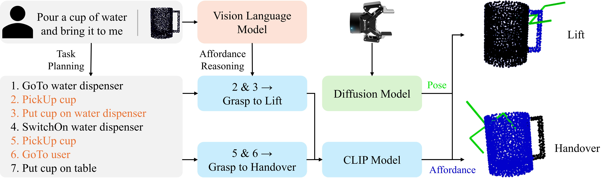
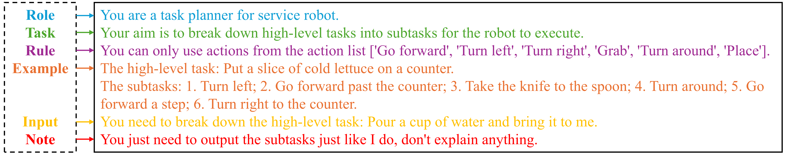
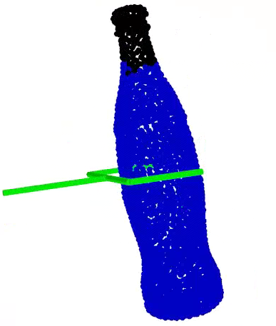

<div align="center">

# Context-Aware Task-Oriented Grasp via Cross-Action Affordance Reasoning


Official code for the paper "Context-Aware Task-Oriented Grasp via Cross-Action Affordance Reasoning".




</div>

The code in this repository is mainly used to train and test AGPENet, and the method proposed in this paper also includes two parts: task planning and affordance reasoning. Since these two parts belong to zero-shot learning, we provide the links to the LlaMa3 and BLIP2 models used in this paper in the "0. Task Planning and Affordance Reasoning" section, and open source the dataset used for fine-tuning LlaMa3.


## 0. Task Planning and Affordance Reasoning

The code for using LlaMa3 is at [LLaMA-Factory](https://github.com/hiyouga/LLaMA-Factory)

The dataset for training LlaMa is at [this https](https://drive.google.com/drive/folders/1iWVkn4zApUh8kYp3s1ZqCZeXNSvynE1u?usp=sharing)

The code for using BLIP2 is at [blip2-opt-2.7b](https://huggingface.co/Salesforce/blip2-opt-2.7b)

<div align="center">



Prompt for LLM reasoning

</div>

## 1. Installation

    conda create -n affpose python=3.8
    conda activate affpose
    conda install pip
    pip install -r requirements.txt


## 2. Dataset
The dataset is available at [this drive folder](https://drive.google.com/drive/folders/1vDGHs3QZmmF2rGluGlqBIyCp8sPR4Yws?usp=sharing).


## 3. Training
Current framework supports training on a single GPU. Followings are the steps for training AGPENet with configuration file ```config/detectiondiffusion.py```.

- In ```config/detectiondiffusion.py```, change the value of ```data_path``` to your downloaded pickle file.
- Change other hyperparameters if needed.

Run the following command to start training:

    python3 train.py --config ./config/detectiondiffusion.py


## 4. Testing
Executing the following command for testing of your trained model:

    python3 detect.py --config <your configuration file> --checkpoint <your  trained model checkpoint> --test_data <test data in the dataset>

Note that we current generate 2000 poses for each affordance-object pair.
The guidance scale is currently set to 0.2. Feel free to change these hyperparameters according to your preference.

The result will be saved to a ```result.pkl``` file.


## 5. Visualization
To visuaize the result of affordance detection and pose estimation, execute the following script:

    python3 visualize.py --result_file <your result pickle file>

Example of training data visualization:

<div align="center">

</div>

## 6. Acknowledgement

Our source code is built based on [3D AffordaceNet](https://github.com/Gorilla-Lab-SCUT/AffordanceNet) and [3DAPNet](https://github.com/Fsoft-AIC/Language-Conditioned-Affordance-Pose-Detection-in-3D-Point-Clouds). We express a huge thank to them.